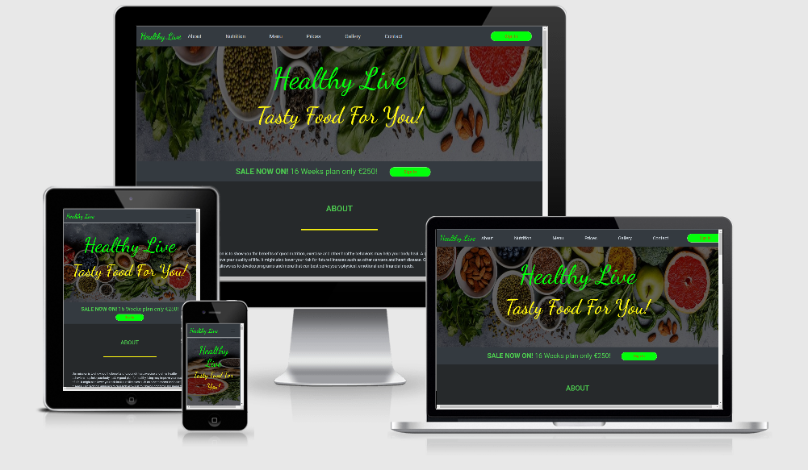
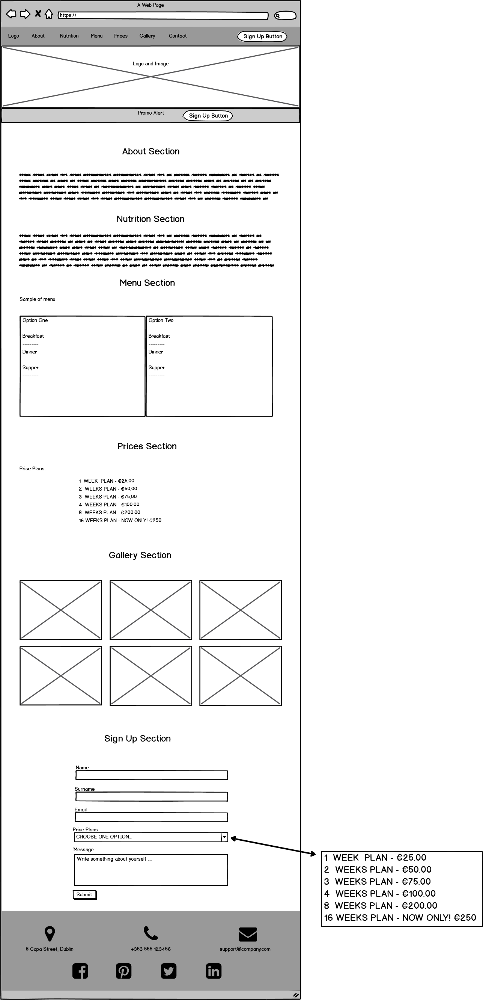
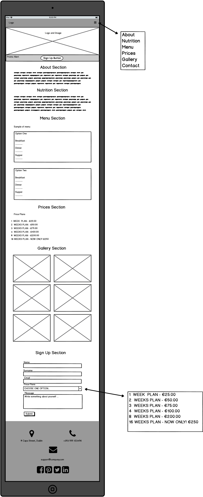
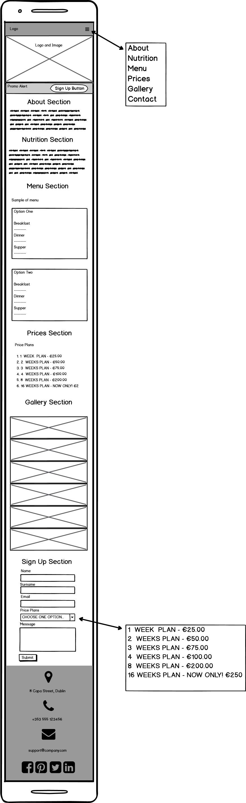

# Project "Healthy Life"

This page has been created for the needs of my first milestone project as a Full Stack software developer student of the Code Institute.

This is a website that aims to promote healthy eating style.

## UX

This website is addressed to people of all ages who want to change their eating habits for a healthier one. The right nutrition plan for an individual, prepared especially for you. An appropriate calorie requirement plan created for a specific person.

## Wireframes

Wireframe shows how the webpage will look on three different devices(Desktop,Ipad and Mobile). Wireframes were designed with [Balsamiq Wireframes 4.0.28](https://balsamiq.com/wireframes/).
Desktop                    |  Ipad                     | Mobile
:-------------------------:|:-------------------------:|:-------------------------:
 |  |  

### Potential User

#### As a potential client:

- I want to be able to view the site on any device like: mobile/tablet/desktop.
- I want to have the ability to register to the site.
- I want to be able to access Support through the website.
- I want to have the ability to connect social media accounts associated with the website like: Facebook, Instagram etc.
- I want to have the ability to see price plans.

## Features

1. Navigation bar - This allows users to easliy access all section on this page.
- About - This section describes our mission. 
- Nutrition - This section clarifies the definition of nutrition.
- Menu - This section shows a Sample menu.
- Price plans - This section shows the price plans.
- Gallery - This section shows sample pictures of food.
- Contact - This section contains contact details under Sign Up Form.
- Sign Up - This button takes you to the form where you can sign up.
2. Footer - This allows users to easily access social media.
- Social media: Facebook, Twitter, Instagram and LinkedIn.
- Contact: Address, Phone and Email.

## Technologies Used

### Language

- HTML - standard language used to create this page.
- CSS - standard language that describes the style of HTML.
- Bootstrap CDN - Used as the core structuring layout for the application, ensuring mobile-first design and screen size fluidity.
- Github - Used to host the repository.
- JQuery - used to simplify DOM manipulation. 

### Tools Used

- Google Fonts - to style the website fonts.
- Font Awesome Icons - to add icons on the web page.

## Testing

The project was tested on development tools in Google Chrome and the responsiveness of mobile devices was also tested.

The first of the testing steps was on W3C Markup Validation and W3C CSS validation.

The second of testing steps was http://ami.responsivedesign.is/, which has been used to see how the site performs on different devices and their viewports. All pages, links, icons performed as expected on all devices. I also used it to create the all-devices.png at the top of this Readme.

The third step was testing by the Slack community, my mentor from the Code Institute and my friends and family.

Testing consists of finding any errors that could reveal the incorrect operation of the website during its use. The website was also tested on mobile devices.

All problems related to the functioning of the site have been resolved.

## Deployment

My website is hosted on GitHub Pages, follow the instructions:

GitHub Pages
Navigate to my Github repository - https://github.com/Maras00/Milestone-Project
Click on the settings tab at the top of the page.
Scroll down to the GitHub Pages section.
Change the source to master branch.
After selecting master branch the page will refresh.
Scroll down to the GitHub Pages section and a green box saying "your site is published at" will appear.
Click the link to go to the published website.

You can view the deployed website here - https://maras00.github.io/Milestone-Project/

Git Clone
Navigate to my Github repository - https://github.com/Maras00/Milestone-Project
Click the green drop down that says clone or download.
To clone with HTTPS copy the URL in the box. https://github.com/Maras00/Milestone-Project.git
Open up your preferred IDE (Integrated Development Environment)
Change the directory to the location you want the clone to be made.
Type git clone and then paste the copied URL from step 3.
Press Enter and your local clone will be created.

## Credits

### Content
- The text for nutrition section was copied from [Wikipedia Nutrition](https://en.wikipedia.org/wiki/Nutrition)

### Media
- The images for logo background and gallery section were copied from [Google Gallery](https://www.google.ie/search?q=healthy+food&client=ms-android-huawei&sxsrf=ALeKk006R8xCGre7PocOmojHTJH1jAEphg:1588587789842&source=lnms&tbm=isch&sa=X&ved=2ahUKEwjlvqHX_pnpAhXCQxUIHXWoCqUQ_AUoAXoECA4QAw&biw=1366&bih=625) 

### Acknowledgements

- I received inspiration and help for this project from my mentor, Slack community, family and friends.